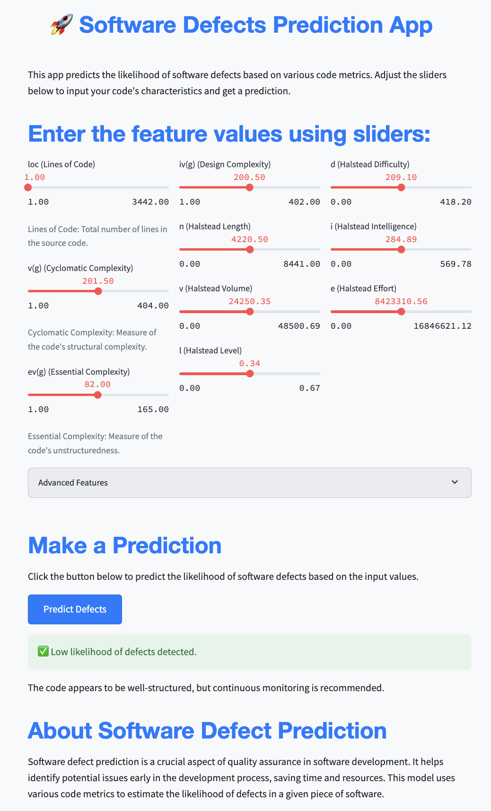

## [Kaggle - Software Defect Prediction](https://www.kaggle.com/competitions/playground-series-s3e23/overview)

This repository is based on my submission to the Software Defect Prediction competition, where I achieved 1st place among 1704 participants.  

**Objective:** Develop a binary classification model to predict the probability of positive defects in C programming modules based on various code attributes. By accurately identifying modules prone to defects, developers can prioritize testing and maintenance efforts more effectively

**Evaluation Metric:** Model predictions are evaluated based on the **Area Under the ROC Curve (AUC-ROC)** comparing the predicted probabilities to the observed targets.  

**Dataset Overview:**  
Target variable:
- `defects`: Binary variable indicating whether the module has defects.

Feature variables:
- `loc`: Lines of Code - Total number of lines of code in the software module
- `v(g)`: Cyclomatic Complexity - Measures the number of linearly independent paths through a program's source code
- `ev(g)`: Essential Complexity - Reflects the number of decision points that are strictly necessary in a program module.
- `iv(g)`: Design Complexity - Measures the complexity of the software architecture design.
- `n`: Total Operators + Operands - The total count of all operators and operands in the code.
- `v`: Halstead Volume - Reflects the size of the implementation; calculated using the number of operations and operands.
- `l`: Halstead Program Length - Measures the program length based on unique operators and operands.
- `d`: Halstead Difficulty - A measure of how difficult the code is to understand and maintain.
- `i`: Halstead Intelligence - Indicates the difficulty of understanding the program logic.
- `e`: Halstead Effort - Represents the effort required to write or understand the software.
- `b`: Halstead Error Estimate - Estimates the number of errors in the implementation.
- `t`: Halstead Time to Implement - Estimates the time it would take to implement the software.
- `lOCode`: Lines of Code without Comments - The number of lines of code excluding comments.
- `lOComment`: Lines of Comments - The number of lines that contain only comments.
- `lOBlank`: Blank Lines - Lines with no code or comments.
- `locCodeAndComment`: Lines of Code and Comment - Lines containing both code and comments.
- `uniq_Op`: Unique Operators - The count of unique operators used in the code.
- `uniq_Opnd`: Unique Operands - The count of unique operands used in the code.
- `total_Op`: Total Operators - The total count of operators in the code.
- `total_Opnd`: Total Operands - The total count of operands in the code.
- `branchCount`: Branch Count - Number of branches in the code; often correlates with the cyclomatic complexity.

**Approach:** For defect prediction, an ensemble of diverse machine learning models was utilized, each contributing to the final prediction through a weighted voting mechanism. The models were selected based on their performance during repeated cross-validation, with hyperparameters optimized using the **Optuna** library. While the ensemble was primarily composed of gradient boosting models, a decision tree-based classifier and a logistic regression model with **Nystroem Kernel Approximation** were also included to capture different aspects of the data. A weighted **Voting Classifier** from **scikit-learn** was employed to aggregate the predictions from each model, with weights assigned based on their individual performance. This ensemble approach improved the overall predictive accuracy while mitigating the risk of overfitting to any single model's biases

**Streamlit Application:**  
Explore the model predictions through our interactive Streamlit app. [(Launch)](https://theod9-kaggle-softwaredefectpredicition-app2-tqtlny.streamlit.app/)  

  

    
     

